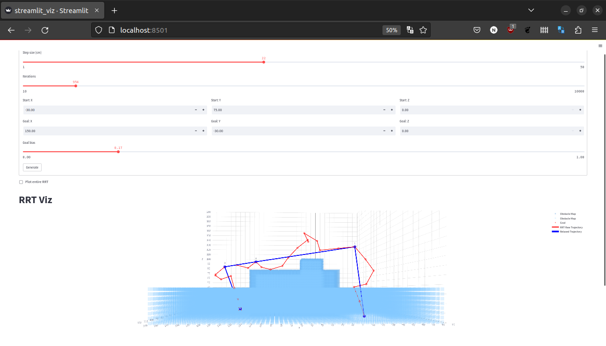
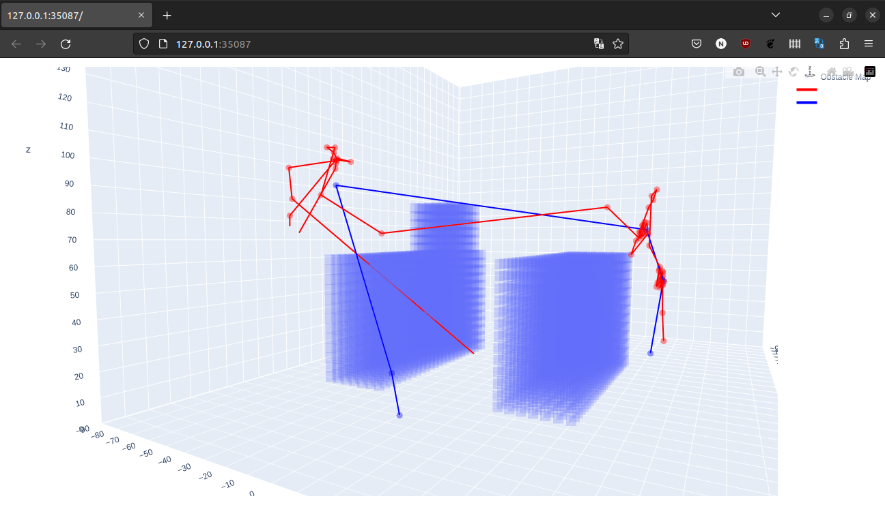

# CrazyFlie RRT

This project contains the code that implements an RRT (Rapidly Expanding Random Tree) path planning algorithm to navigate a CrazyFlie quadcopter through an obstacle map. This was created as part of a ~2.5 week project for course project @Olin College of Engineering.

## So what is an RRT and why use it?
Neither of us have used or implemented an RRT before. We had played with A* for path planning before but wanted to try something new! RRT’s are a broad class of tree based planning algorithms. The simplest RRT works by randomly sampling points within a state space and extending a graph towards that point from the nearest node already in the graph. This repeats until the goal is reached. As you can imagine there are many improvements on this algorithm making it suited to different tasks. A few simple examples are RRT* which makes the RRT behave somewhat like A*, imposing state constraints per timestep/move, probabilistic implementations,  an updating RRT that updates the graph’s shortest paths if a better path can be found etc. 

We thought an RRT would be well suited to this problem because RRT’s can expand dimensionality very easily and can easily be constrained -- all things that are harder for something like A*. We were also interested in trying to plan in 3d since we have a system that can easily move across these dimensions. 

On their own, RRTs trajectories are slower to generate and less optimal compared to A*. However, this sub-optimality of RRTs makes them much faster than A* in high dimensional spaces, which makes them able to plan on the full state-space of the robot, rather than just its position space. This is crucial for a couple of reasons:
For dynamic robots like drones, planning on the state space enables the trajectory planner to properly account for the underlying dynamics of the drone. 
For highly articulated robot arms, RRTs enable planning around obstacles fully in the joint space, making it straightforward to ensure the entire arm is collision-free.

Finally, for non-holonomic robots, planning in the state space enables the planner to actually express the non-holonomic constraints, making it possible to plan trajectories for vehicles such as cars that can only turn left!

## Integrating the different parts
#### 3d Obstacle Map
To do our path planning we needed to have a full understanding of the world we are operating under. We wrote a 3d occupancy grid using numpy. We have operated with a grid size of 5cm to accurately plan around obstacles. This occupancy grid is key for allowing planning of valid paths using the RRT and is needed to create a visualization of the world. The obstacle map provides an easy interface to add and subtract obstacles, check if paths are valid, and project points to and from the grid. 

#### RRT
The RRT is very quick to run. This is a sample based algorithm but in our scenarios, we are able to find a reasonable path within a few hundred iterations, this doesn’t take very much time at all! We interface with the RRT algorithm by choosing some parameters that specify its run ie. step size, max iterations, goal bias. Once the RRT reaches the goal, we work backwards from the goal to construct a path from the starting position to the goal. We also relax the path after it is created. This means that we remove points from the path that are not needed. At any point along the path we now go to the next point furthest along the path that we can go along without hitting obstacles. This is great because it simplifies our path, however, it makes the nodes on our path unequally spaced which makes our control. This path is saved to disk as a list of points.

#### CrazyFlie (cflib)
The Crazyflie offers several different modes of controls, from generating specific low-level trajectories to high level position setpoints. Our simple RRT implementation generates positions so we opted to use the Crazyflie’s position navigation api instead of generating lower level trajectory control points. We use the cflib to travel to each node in the path for 5 seconds. This is a very rudimentary way of following our path, but works for our validation of this algorithm.

## Results
Here we see in our visualization tool that the crazyflie successfully took off, followed the waypoints to avoid the obstacles, and then landed at the destination The blue line is the generated set of waypoints from our trajectory generator. The red line is the Crazyflie state estimate throughout the trajectory. 

Ok, we lied a little bit. In the real world, the obstacles had to be removed for this trajectory to work. When the obstacles were in place, their interference with the crazyflie’s state estimation made the crazyflie's trajectory tracking signifcantly worse, and thus they would crash. A video of a successful run can be found here: https://photos.app.goo.gl/aF24oZpEXj5EFtAVA. Unfortunately, a run with a successful landing was not caught on camera.

## Next Time
Interfacing with the physical Crazyflies was really difficult for us. We feel like this project attempted too much in the timespan give. It would have been preferable to spend the entire time learning about RRT-like algorithms or the entire time experimenting with obstacle avoidance on the physical Crazyflie -- not both. We note that planning in 3d was probably not necessary. However, by doing so we were able to do some smart path planning that went over different height obstacles. 

We really wanted to try imposing a dynamics/control model onto the RRT to generate trajectory primitives rather than setpoints/waypoints. The dorm 

## Running this yourself

#### Getting started
Clone Recursively:
`git clone --recurse-submodules git@github.com:teadetime/crazyflie-rrt.git`

Make a venv:
`python3 -m venv .venv`

Activate it later using:
`source .venv/bin/activate`

Install requirements:
`pip install -r requirements.txt`

Install crazyflie:
`cd crazyflie`
`pip install -e .`

#### File structure
There are 4 main components:
1. Rrt.py
	This file houses the RRT class and implementation
2. Occupancy_map.py
	This file contains logic building and using an occupancy_map
3. Viz.py
	Provides Plotly interface for Occupancy_map and trajectories
4. Streamlit_viz.py
	Interface to run the rrt with our occupancy grid to create a trajectory via a web app
5. Fly.py
	Crazyflie interface with generated points from streamlit_viz.py
6. results.py
Final plotly/html visualization from recorded Crazyflie flight

#### Example Run Process
First we run `streamlit_viz.py` and generate a path (shown in red). This path is pickled to disk.

Then we run the crazyflie with `fly.py` (having specified the newly pickled object to be loaded)

Then we validate the results using `results.py` which allows us to see the recorded state during our flight.

